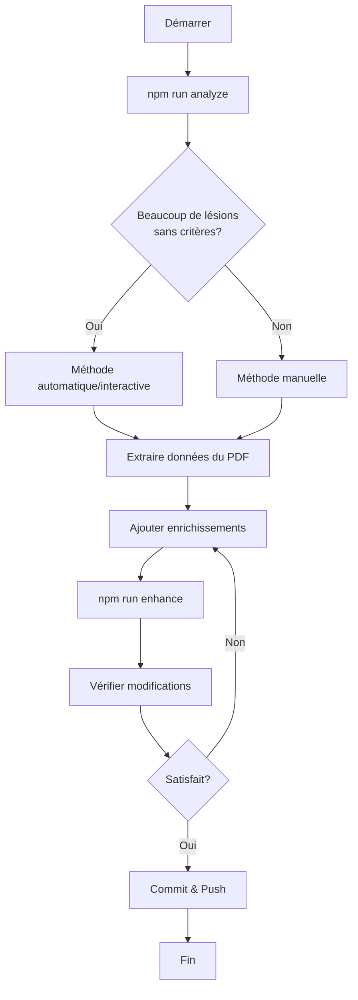

# 🚀 Système d'Enrichissement de la Base de Données IPP

## 📋 Vue d'ensemble

Ce système vous permet d'enrichir facilement la base de données IPP (Incapacité Permanente Partielle) avec toutes les informations du PDF "BAREME DES TAUX MEDICAUX DES ACCIDENTS DU TRAVAIL".

### 📊 État actuel
- ✅ **962 lésions** enregistrées
- ⚠️ **765 lésions** sans critères d'évaluation détaillés
- ⚠️ **117 lésions** avec de larges plages sans description

## 🛠️ Outils disponibles

### 1. 📊 Analyseur de données
Analyse la base de données actuelle et identifie les améliorations nécessaires.

```bash
npm run analyze
```

**Résultat:**
- Statistiques générales (catégories, sous-catégories, lésions)
- Nombre de lésions sans critères
- Suggestions d'amélioration prioritaires

### 2. 📝 Outil interactif d'enrichissement
Interface en ligne de commande pour ajouter facilement des enrichissements.

```bash
npx tsx scripts/interactiveEnhancer.ts
```

**Fonctionnalités:**
- Ajout guidé de critères d'évaluation
- Validation en temps réel
- Génération automatique du code TypeScript
- Sauvegarde dans un fichier horodaté

### 3. 🔄 Applicateur d'enrichissements
Applique automatiquement les enrichissements à la base de données.

```bash
npm run enhance
```

**Actions:**
- Lit les enrichissements dans `enhanceDatabase.ts`
- Trouve et met à jour les lésions correspondantes
- Génère un rapport des modifications

### 4. 📄 Extracteur PDF (optionnel)
Extrait le texte du PDF pour faciliter l'analyse.

```bash
# Installer la dépendance
npm install pdf-parse

# Exécuter l'extraction
npm run extract-pdf
```

## 🎯 Méthodes d'enrichissement

### Méthode 1: Interactive (Recommandée pour débuter)

1. **Lancez l'outil interactif:**
   ```bash
   npx tsx scripts/interactiveEnhancer.ts
   ```

2. **Suivez les instructions:**
   - Copiez le nom exact de la lésion depuis `disabilityRates.ts`
   - Ajoutez les critères d'évaluation depuis le PDF
   - Confirmez

3. **Appliquez les enrichissements:**
   ```bash
   # Copiez le contenu généré dans enhanceDatabase.ts
   npm run enhance
   ```

### Méthode 2: Manuelle directe

1. **Ouvrez `scripts/enhanceDatabase.ts`**

2. **Ajoutez vos enrichissements dans l'objet `enhancements`:**
   ```typescript
   const enhancements = {
     "Nom de la lésion": {
       rateCriteria: {
         low: "Description taux minimum",
         medium: "Description taux moyen (optionnel)",
         high: "Description taux maximum"
       },
       description: "Description générale (optionnel)"
     },
     // ... autres enrichissements
   };
   ```

3. **Exécutez:**
   ```bash
   npm run enhance
   ```

### Méthode 3: Extraction PDF automatique

1. **Installez la dépendance:**
   ```bash
   npm install pdf-parse
   ```

2. **Placez le PDF dans le dossier `data/`**

3. **Extrayez le texte:**
   ```bash
   npm run extract-pdf
   ```

4. **Analysez le texte extrait** dans `data/pdf-extracted.txt`

5. **Utilisez la méthode 1 ou 2** pour ajouter les données

## 📚 Format des enrichissements

### Structure complète
```typescript
"Nom exact de la lésion": {
  rateCriteria: {
    low: "Situation la plus favorable, limitations minimes",
    medium: "Situation intermédiaire (optionnel)",
    high: "Situation la plus défavorable, handicap important"
  },
  description: "Description médicale précise de la lésion",
  notes: "Notes supplémentaires du barème officiel"
}
```

### Exemples pratiques

#### Exemple 1: Lésion avec plage de taux
```typescript
"Fracture du scaphoïde carpien (Main Dominante)": {
  rateCriteria: {
    low: "Bien consolidée, douleurs d'effort légères, mobilité > 80%",
    medium: "Cal vicieux, raideur modérée et douleurs, mobilité 50-80%",
    high: "Pseudarthrose, arthrose radio-carpienne, perte de force majeure, mobilité < 50%"
  },
  description: "Fracture de l'os scaphoïde du carpe avec complications possibles"
}
```

#### Exemple 2: Lésion avec taux fixe
Pour les lésions avec un taux fixe (ex: `rate: 25`), les critères ne sont pas nécessaires, mais vous pouvez ajouter une description:

```typescript
"Ankylose Pouce - Toutes articulations en flexion modérée (Main Dominante)": {
  description: "Blocage complet du pouce en position de flexion modérée, permettant une opposition partielle"
}
```

## 📖 Guide de rédaction des critères

### Critères LOW (Taux minimum)
- Lésion bien consolidée
- Mobilité conservée (> 70%)
- Douleurs absentes ou minimes
- Activités quotidiennes peu affectées
- Position fonctionnelle

**Exemple:** "Fracture bien consolidée sans raccourcissement, mobilité quasi-normale"

### Critères MEDIUM (Taux moyen)
- Consolidation avec séquelles modérées
- Mobilité limitée (40-70%)
- Douleurs intermittentes
- Gêne fonctionnelle notable
- Adaptation nécessaire

**Exemple:** "Cal vicieux modéré avec limitation de 30-50% de la mobilité"

### Critères HIGH (Taux maximum)
- Complications sévères
- Mobilité très limitée (< 40%)
- Douleurs permanentes
- Handicap important
- Position vicieuse
- Troubles associés

**Exemple:** "Pseudarthrose, arthrose sévère, douleurs permanentes, perte de fonction majeure"

## 🔍 Workflow complet



## ✅ Checklist de progression

### Phase 1: Préparation
- [ ] Installer les dépendances: `npm install`
- [ ] Copier le PDF dans `data/`
- [ ] Exécuter l'analyse: `npm run analyze`

### Phase 2: Extraction (si PDF numérique)
- [ ] Installer pdf-parse: `npm install pdf-parse`
- [ ] Extraire le texte: `npm run extract-pdf`
- [ ] Vérifier `data/pdf-extracted.txt`

### Phase 3: Enrichissement prioritaire
- [ ] **Membres supérieurs - Doigts** (100+ lésions)
- [ ] **Poignet et avant-bras** (50+ lésions)
- [ ] **Coude et épaule** (40+ lésions)
- [ ] **Membres inférieurs - Orteils et pied** (30+ lésions)
- [ ] **Cheville et jambe** (30+ lésions)

### Phase 4: Enrichissement secondaire
- [ ] **Rachis et moelle épinière** (50+ lésions)
- [ ] **Nerfs périphériques** (40+ lésions)
- [ ] **Genou et cuisse** (25+ lésions)

### Phase 5: Enrichissement complet
- [ ] **Tête, face et cou** (100+ lésions)
- [ ] **Thorax et abdomen** (30+ lésions)
- [ ] **Appareil génito-urinaire** (35+ lésions)
- [ ] **Séquelles vasculaires** (10+ lésions)

### Phase 6: Validation
- [ ] Tester le calculateur avec les nouvelles données
- [ ] Vérifier la cohérence des taux
- [ ] Relancer `npm run analyze`
- [ ] Atteindre < 100 lésions sans critères

## 📊 Statistiques cibles

| Métrique | Actuel | Objectif |
|----------|--------|----------|
| Lésions totales | 962 | 1000+ |
| Lésions sans critères | 765 | < 100 |
| Lésions sans description | 117 | < 50 |
| Couverture des critères | 20% | 90%+ |

## 🎓 Ressources

### Documentation
- [`docs/ENRICHISSEMENT_GUIDE.md`](./ENRICHISSEMENT_GUIDE.md) - Guide détaillé
- PDF officiel: `data/BAREME DES TAUX MEDICAUX DES ACCIDENTS DU TRAVAIL.pdf`

### Scripts disponibles
- `scripts/analyzePdfData.ts` - Analyse de la base
- `scripts/enhanceDatabase.ts` - Application des enrichissements
- `scripts/extractPdfText.ts` - Extraction du PDF
- `scripts/interactiveEnhancer.ts` - Outil interactif

### Fichiers de données
- `data/disabilityRates.ts` - Base de données principale
- `data/civilCode.ts` - Code civil algérien
- `data/professionalDiseases.ts` - Maladies professionnelles

## ❓ FAQ

**Q: Puis-je modifier directement `disabilityRates.ts`?**
R: Oui, mais il est recommandé d'utiliser le système d'enrichissement pour maintenir la traçabilité.

**Q: Que faire si une lésion n'existe pas dans la base?**
R: Ajoutez-la manuellement dans `disabilityRates.ts` dans la catégorie appropriée.

**Q: Comment gérer les cas ambigus du PDF?**
R: Ajoutez une note explicative dans le champ `notes` de l'enrichissement.

**Q: Puis-je enrichir plusieurs lésions à la fois?**
R: Oui, utilisez l'outil interactif ou ajoutez plusieurs entrées dans `enhanceDatabase.ts`.

**Q: Comment vérifier mes modifications?**
R: Exécutez `npm run analyze` avant et après pour comparer les statistiques.

## 🤝 Contribution

Pour contribuer à l'enrichissement de la base:

1. **Fork** le projet
2. **Créez une branche** pour votre enrichissement
3. **Utilisez le système** décrit ci-dessus
4. **Committez** vos changements avec des messages clairs
5. **Créez une Pull Request**

### Convention de nommage des commits
```
enrich: ajout critères pour [catégorie] (X lésions)
fix: correction taux pour [lésion]
docs: mise à jour guide d'enrichissement
```

## 📞 Support

Pour toute question ou problème:
- Consultez la documentation dans `docs/`
- Vérifiez les exemples dans `scripts/enhanceDatabase.ts`
- Exécutez `npm run analyze` pour diagnostiquer

---

**Bon enrichissement! 🚀**
